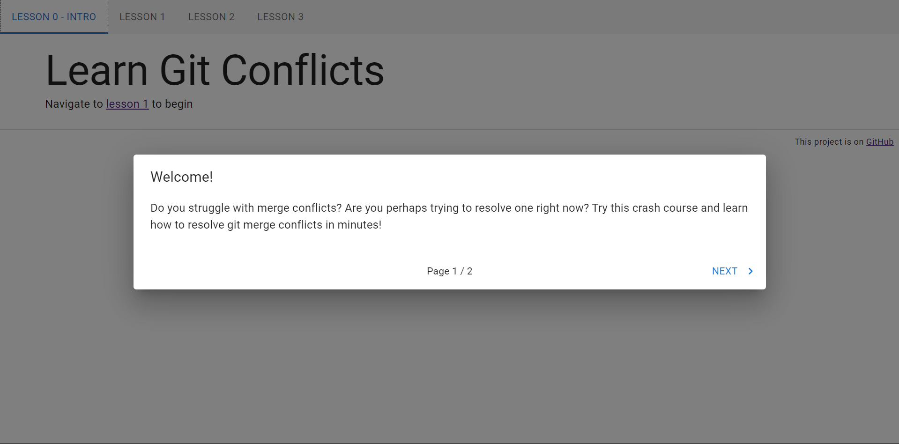

# Learn Git Conflicts

## Description

A tutorial about git merge conflicts. This tutorial was inspired by [learngitbranching](https://learngitbranching.js.org/), a far more developed experience created by [Peter Cotl](https://github.com/pcottle) that introduces git in general.

## Building this project

Follow these steps to get the app running on your machine.

### Prerequisites

-   Have [Node.js](https://nodejs.org/) installed

### Getting started

After cloning this repository, launch a terminal at the root of this project `/Learn-Git-Conflicts`

Install npm packages

```
npm install
```

Build the app

```
npm run build
```

Run the built app

```
npm start
```

Navigate to "<http://localhost:3000>" using a browser. If successful, this is what you should see



## Built with

-   [Next.js](https://nextjs.org/)
-   [Material UI](https://mui.com/)
